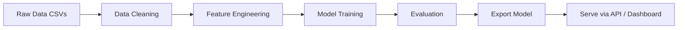

# 🚗 Used Car Value Forecasting — README (Polished, Dynamic & Graphical)

<div align="center">


[]()
[]()
[]()

</div>

---

## 🔎 Project summary

**Used Car Value Forecasting** is an end-to-end machine learning project that predicts the resale price of used automobiles. The repo demonstrates data ingestion, exploratory data analysis (EDA), feature engineering (including handling categorical/temporal features), model training (baseline → ensemble → tuned), evaluation (RMSE / MAE / R²), and lightweight deployment options (API / Streamlit dashboard).

Ideal for:

* Data scientists learning regression workflows
* Students building portfolios with an applied ML problem
* Developers wanting an ML-to-production example with model cards and serving templates

---

## ✨ Key features

* Clean, reproducible Jupyter/Colab notebooks covering full pipeline.
* Baseline models (Linear Regression), tree-based models (Random Forest, XGBoost/LightGBM), and ensembling examples.
* Feature engineering recipes: age calculation, mileage normalization, categorical encoding, interaction features.
* Evaluation focused on business metrics: RMSE, MAE, R², and calibration.
* Model export & simple REST/Streamlit deployment templates.
* Notebook includes visual EDA: price distributions, feature importance, partial dependence plots.

---

## 📁 Suggested repository structure

```text
Used-Car-Value-Forecasting/
├── notebooks/
│   ├── 01-exploratory-analysis.ipynb
│   ├── 02-feature-engineering.ipynb
│   ├── 03-modeling-baselines.ipynb
│   └── 04-model-tuning-and-interpretability.ipynb
├── src/
│   ├── data/             # data loaders & preprocessing pipelines
│   ├── features/         # feature engineering utils
│   ├── models/           # training & prediction wrappers
│   └── viz/              # plotting helpers
├── app/                  # Streamlit / FastAPI demo app
├── models/               # saved artifacts (.pkl / .joblib)
├── notebooks_export/     # exported PDF versions (optional)
├── requirements.txt
├── README.md
└── LICENSE
```

---

## 🧭 Workflow (visual)



---

## 🚀 Quickstart — run locally or on Colab

### Run in Google Colab (recommended for instant reproducibility)

1. Open `notebooks/01-exploratory-analysis.ipynb` in Colab.
2. Upload the dataset when prompted (or mount Drive).
3. Run cells sequentially.

### Local setup

```bash
# 1. Clone
git clone https://github.com/prak05/Used-Car-Value-Forecasting.git
cd Used-Car-Value-Forecasting

# 2. Create environment
python -m venv venv
# mac/linux
source venv/bin/activate
# windows
# venv\Scripts\activate

pip install -r requirements.txt  # or pip install -U pandas scikit-learn xgboost lightgbm joblib streamlit matplotlib seaborn
```

### Train a quick baseline (example)

```bash
# python src/models/train_baseline.py --data data/used_cars.csv --output models/baseline.joblib
python src/models/train_baseline.py
```

### Run demo app (Streamlit)

```bash
streamlit run app/streamlit_app.py
```

---

## 📊 Typical modeling choices & metrics

* **Feature ideas:** age (current year − manufacture year), normalized mileage (km/year), brand/category dummies, fuel type, transmission, previous owners, service history flags.
* **Models tried:** Linear Regression, Ridge/Lasso, Random Forest, XGBoost / LightGBM, Stacking Ensemble.
* **Evaluation metrics:** RMSE (primary), MAE (robustness), R² (explained variance). Use cross-validation to estimate generalization.
* **Business notes:** calibrate predictions using quantile regression or prediction intervals when needed.

---

## 🧰 Example `requirements.txt` (starter)

```
pandas
numpy
scikit-learn
xgboost
lightgbm
joblib
matplotlib
seaborn
streamlit
fastapi
uvicorn
shap
```

Pin versions as needed for reproducibility.

---

## 🔁 Data & privacy notes

* Do **not** commit raw or private datasets. Place them in `data/` and add `data/` to `.gitignore` if needed.
* Provide `data/README.md` with instructions on dataset schema and any required preprocessing (e.g., column names, units).
* If using third-party datasets (Kaggle, governmental), include citation and download instructions.

---

## 📦 Model export & serving

* Save trained models using `joblib.dump(model, "models/xgb.joblib")`.
* Example minimal FastAPI endpoint:

```python
from fastapi import FastAPI
from pydantic import BaseModel
import joblib

app = FastAPI()
model = joblib.load("models/xgb.joblib")

class CarFeatures(BaseModel):
    year: int
    mileage: float
    brand: str
    # add other fields

@app.post("/predict")
def predict(payload: CarFeatures):
    # preprocess payload -> feature vector
    # pred = model.predict([features])[0]
    return {"predicted_price": float(pred)}
```

* Or build an interactive Streamlit app to let users enter car attributes and get instant price estimates.

---

## 🧾 Reproducibility & best practices

* Fix random seeds (`np.random.seed`, `random.seed`) and document versions in `requirements.txt`.
* Track experiments (MLflow or simple CSV logs) with hyperparameters and CV scores.
* Include a small synthetic sample dataset for CI tests so unit tests can run without large files.

---

## 🤝 Contributing

Contributions are welcome! Great contributions include:

* Improved feature engineering recipes (explain why a feature helps).
* Additional modeling baselines and robust cross-validation strategies.
* A Streamlit/Flask demo with deployment instructions.
* Better EDA visuals and model interpretability (SHAP/partial dependence).

Flow:

1. Fork → new branch (`feat/add-lightgbm`) → commit → PR.
2. Add a `notebooks/` or `src/` test and update `requirements.txt`.
3. Describe changes & attach sample outputs in PR.

---

## ⚖️ License

This project is released under the **MIT License**. See `LICENSE` for details.

---

## 👤 Author

**prak05** — ML experiments & practical forecasting demos.

---

Would you like me to:

* paste the ready-to-commit `README.md` (formatted exactly for GitHub), or
* generate a sample `app/streamlit_app.py` and `src/models/train_baseline.py` starter scripts, or
* scan the repo and produce a pinned `requirements.txt` by extracting imports from notebooks?

Pick one and I’ll produce it now.
